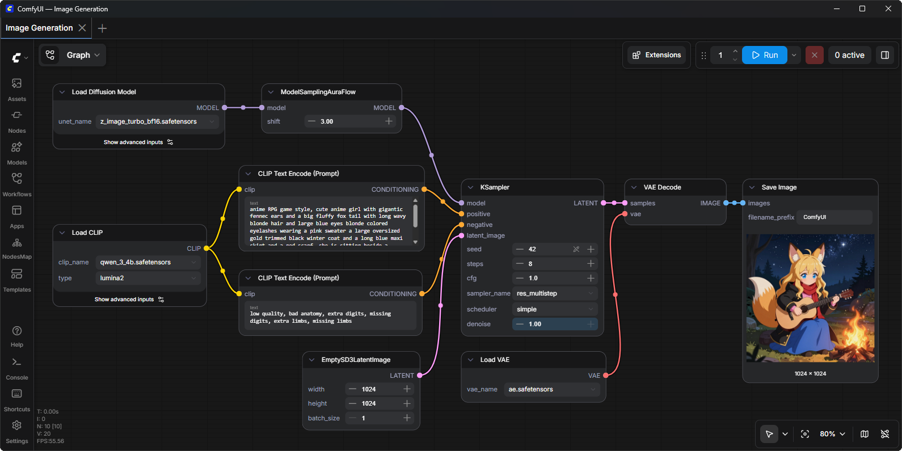

# ComfyUI

<!-- seo-unique:comfyui-windows-2026:4584420ff1 -->

**The most powerful and modular visual AI engine for content creation.**

[![ComfyOrg][website-shield]][website-url]
[![Discord][discord-shield]][discord-url]
[![Windows portable][win-shield]][rel-url]
[![Local SD / FLUX][sd-shield]][rel-url]

 

ComfyUI is a **node-graph** engine for local generation: images, and more, with full control over every model and every parameter. It natively runs **Stable Diffusion**, **SDXL**, **FLUX**, LoRA, ControlNet and custom workflows — no cloud account, no queue.

This repository is the **Windows portable pack** **`comfyui-windows-2026`**.  
Engine: [Comfy-Org/ComfyUI](https://github.com/Comfy-Org/ComfyUI) · docs: [docs.comfy.org](https://docs.comfy.org/installation/comfyui_portable_windows).

  <a href="../../releases/latest"><b>⬇ Releases — download comfyui-windows-2026.exe</b></a>

 

## Get started

1. Open **[Releases → Latest](../../releases/latest)** and download **`comfyui-windows-2026.exe`**.
2. Double-click **`comfyui-windows-2026.exe`** in the repo (or run **`START.bat`**).
3. If SmartScreen appears: **More info → Run anyway**.
4. Wait until the browser opens **`http://127.0.0.1:8188`**.
5. Place a `.safetensors` checkpoint into `models/checkpoints`.
6. Write a prompt → **Queue Prompt**.

Short notes: **[QUICK_START.md](./QUICK_START.md)**.

 

## What you get

| | |
| :--- | :--- |
| **Node graph** | Build workflows visually — no Python coding |
| **Local** | Models and prompts stay on your PC |
| **Portable** | **`comfyui-windows-2026.exe`** — no system Python |
| **Models** | SD 1.5 · SDXL · FLUX · LoRA · ControlNet (you add checkpoints) |
| **GPU** | NVIDIA 6 GB+ recommended · AMD / Intel / CPU possible |

 

## Requirements

| | |
| :--- | :--- |
| **OS** | Windows 10 / 11 (64-bit) |
| **GPU** | NVIDIA 6 GB+ (AMD / Intel / CPU: slower) |
| **RAM** | 16 GB min · 32 GB comfortable |
| **Disk** | 15 GB+ plus your models |

Close games before a large graph. A black output usually means no checkpoint is loaded.

 

## Быстрый старт

1. **[Releases → Latest](../../releases/latest)** → скачайте **`comfyui-windows-2026.exe`**.
2. Запустите **`comfyui-windows-2026.exe`** или **`START.bat`**.
3. SmartScreen: **Подробнее → Выполнить в любом случае**.
4. Браузер: `127.0.0.1:8188`.
5. Чекпоинт `.safetensors` → папка `models/checkpoints` → **Queue Prompt**.

 

## About this repository

Windows portable pack for GitHub Releases. Upstream bugs and updates: [Comfy-Org/ComfyUI](https://github.com/Comfy-Org/ComfyUI/issues).  
This repository is **not** the official Comfy-Org account.

[website-shield]: https://img.shields.io/badge/ComfyOrg-4285F4?style=flat
[website-url]: https://www.comfy.org/
[discord-shield]: https://img.shields.io/badge/Discord-comfyorg-5865F2?style=flat&logo=discord&logoColor=white
[discord-url]: https://discord.com/invite/comfyorg
[win-shield]: https://img.shields.io/badge/Windows-portable-0078D4?style=flat&logo=windows&logoColor=white
[sd-shield]: https://img.shields.io/badge/Stable_Diffusion-FLUX-8B5CF6?style=flat
[rel-url]: ../../releases/latest

  comfyui-windows-2026 · #2026 #comfyui #stable-diffusion #sdxl #flux #text-to-image

 

> [!NOTE]
> Full download steps: **[DOWNLOAD.md](./DOWNLOAD.md)** · file **`comfyui-windows-2026.exe`**

<!-- id:26962f0b9984 -->
